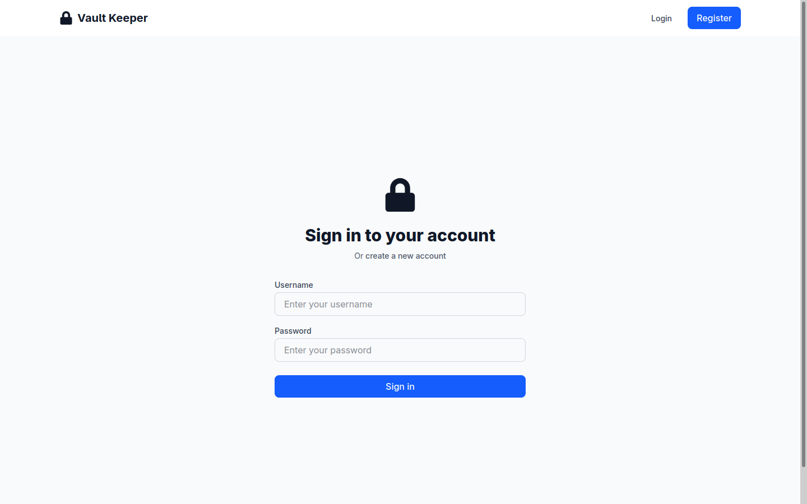
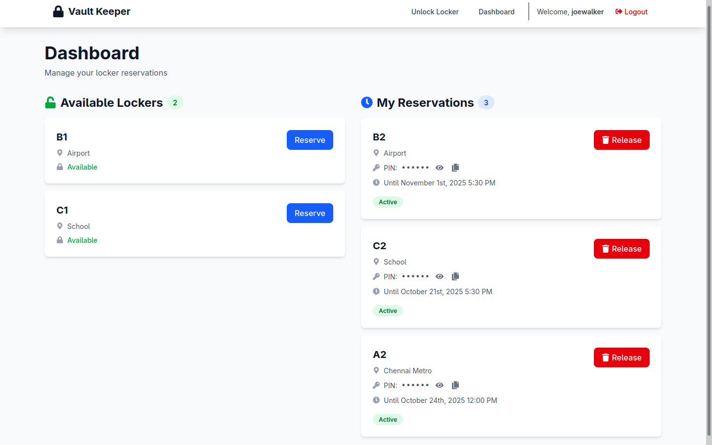
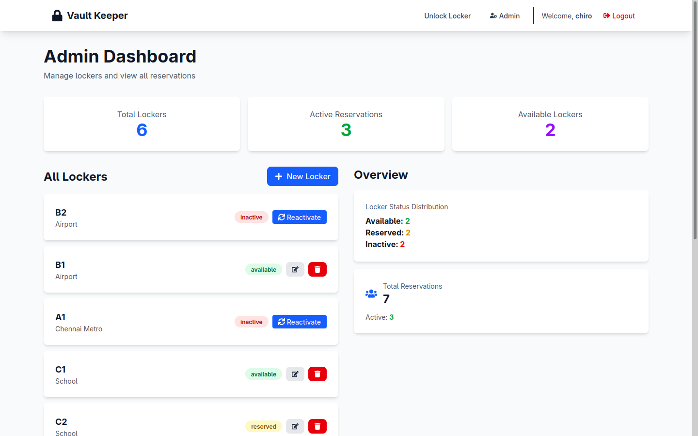

# Smart Locker Management System

This is a full-stack web application designed to manage smart lockers. It provides a user-friendly interface for users to reserve and access lockers, and a powerful dashboard for administrators to manage the system.

## Tech Stack

- **Backend:**
  - Django
  - Django REST Framework
  - Simple JWT for authentication
  - PostgreSQL (via psycopg2)

- **Frontend:**
  - React.js (with Vite)
  - React Router for navigation
  - Axios for API communication
  - Tailwind CSS for styling

## Features

- User registration and authentication
- Locker reservation and management
- Secure access to lockers using a PIN
- Admin dashboard for user and locker management
- Real-time updates on locker availability

## Screenshots

### Login Page


### User Dashboard


### Admin Dashboard


## Prerequisites

- Python 3.8+ and Pip
- Node.js and npm
- PostgreSQL database

## Getting Started

### Backend Setup (Django)

1.  **Install POstgreSQL**
    ```sql
    -- Log in to PostgreSQL
    psql -U postgres

    -- Create database
    CREATE DATABASE locker_db;

    -- Create user
    CREATE USER locker_user WITH PASSWORD 'secretpass';

    -- Grant privileges
    GRANT ALL PRIVILEGES ON DATABASE locker_db TO locker_user;
    ```
2.  **Navigate to the Django directory:**
    ```bash
    cd django
    ```

3.  **Create and activate a virtual environment:**

    ## Linux/macOS
    ```
    python -m venv .venv
    source .venv/bin/activate
    ```
    ## Windows (CMD)
    ```
    python -m venv .venv
    .venv\Scripts\activate
    ```
    ## Windows (PowerShell)
    ```
    python -m venv .venv
    .venv\Scripts\Activate.ps1
    ```

4.  **Install the required dependencies:**
    ```bash
    pip install -r requirements.txt
    ```

5.  **Set up your environment variables:**
    - Copy the example environment file:
      ```bash
      cp .env.example .env
      ```
    - Edit the `.env` file with your database credentials and secret key.

6.  **Run the database migrations:**
    ```bash
    python manage.py migrate
    ```

7.  **Start the development server:**
    ```bash
    python manage.py runserver
    ```
    The backend will be running at `http://127.0.0.1:8000`.

### Frontend Setup (React)

1.  **Navigate to the frontend directory:**
    ```bash
    cd frontend
    ```

2.  **Install the required dependencies:**
    ```bash
    npm install
    ```

3.  **Start the development server:**
    ```bash
    npm run dev
    ```
    The frontend will be running at `http://localhost:5173`.

## API Endpoints

A comprehensive list of API endpoints can be found in `django/lockers/urls.py`. Key endpoints include:

- `POST /api/register/`: User registration
- `POST /api/token/`: Obtain JWT token
- `GET /api/lockers/`: List all lockers
- `POST /api/reservations/`: Create a new reservation
- `POST /api/lockers/unlock/`: Unlock a locker with a PIN

## Contributing

Contributions are welcome! Please feel free to submit a pull request.
